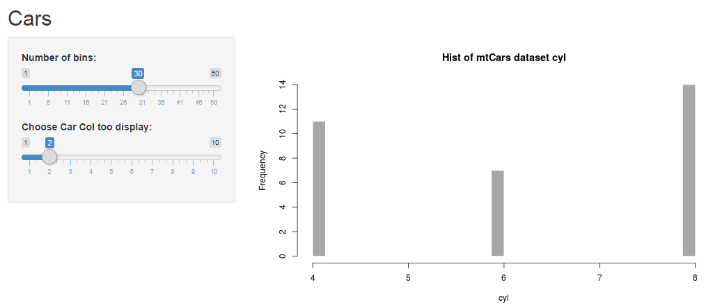
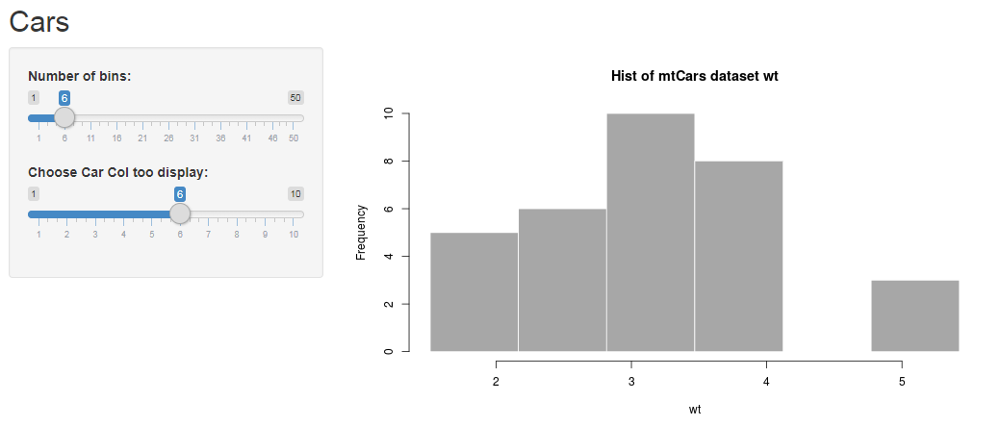

## Data Exploration Tool

1. Adjust bins of Histogram
2. Choose Car Col to display
3. Explore data!

Using Mtcars data as an example
```{r}
head(mtcars)
```


--- .class #id 

## Shiny Web App
### Allows for quick exploration of data
#### Here we see this data set has 4, 6 and 8 cylinder cars
```{r Cars1, echo=FALSE, fig.cap="A caption", out.width = '100%'}

```

---

##  Shiny Web App
### Here we see the distributions of Car Weights in our Data 
```{r Cars2, echo=FALSE, fig.cap="A caption", out.width = '100%'}

```

--- .class #id 


## Closing
- This a useful shiny app
- Thank you for reading


